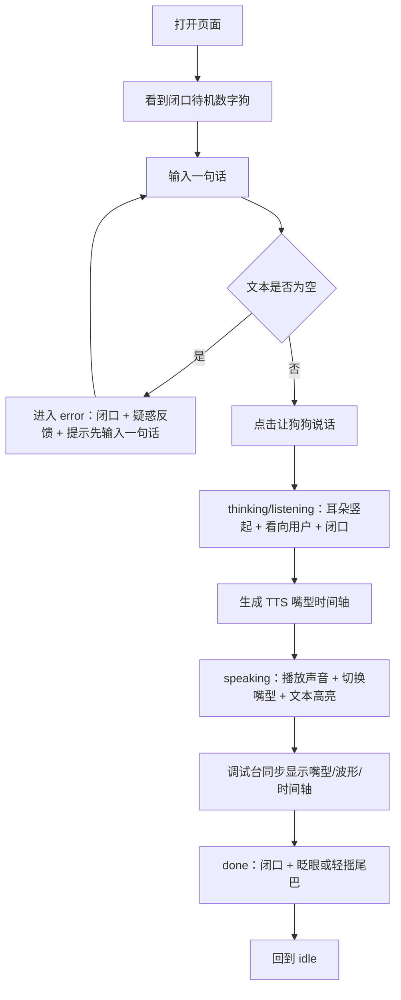
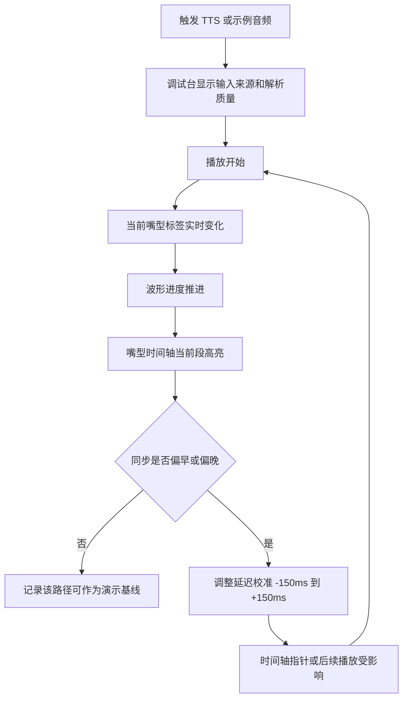
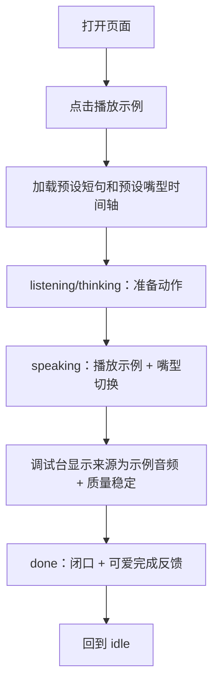
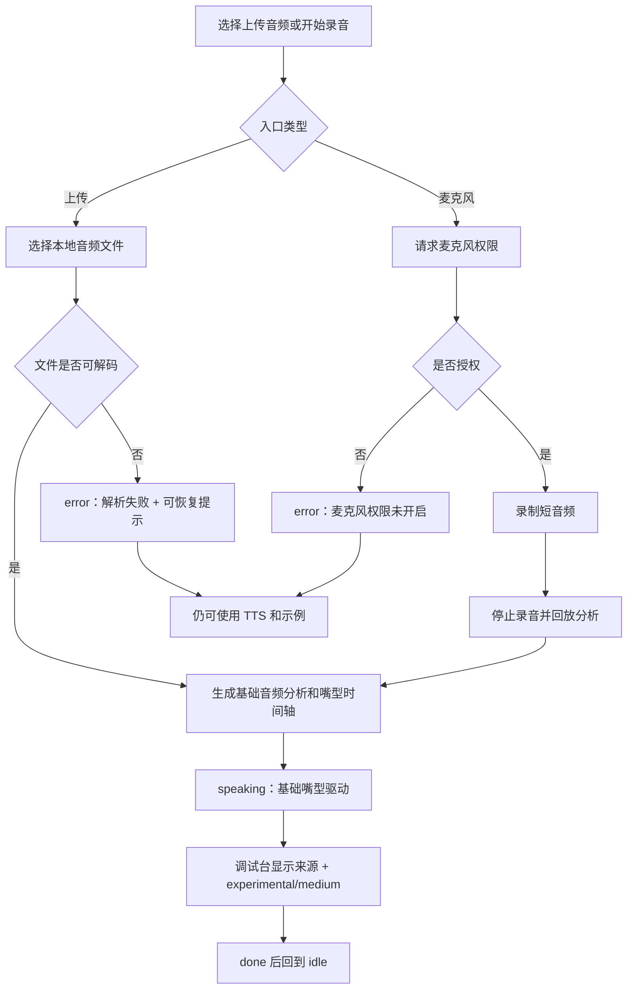

# UX 设计规格：数字狗语音口型 Demo

**作者：** kejincheng  
**日期：** 2026-06-23  
**修订日期：** 2026-06-24

---

<!-- UX 设计内容会按 BMAD UX 工作流逐步追加。 -->

## 执行摘要

### 平台纠偏

2026-06-24 起，第一版展示设备更正为 **小米 Redmi Pad SE 11 英寸 MIUI / Android 平板**。本文后续历史段落中出现的 iPad、iPadOS、SwiftUI、SF Symbols、VoiceOver、Reduce Motion 等表述，均按 Redmi Pad SE / Android 原生方案解释：横屏按 1920 x 1200 / 16:10 平板视口优化，竖屏按 1200 x 1920 可用形态处理；技术实现优先 Kotlin、Jetpack Compose、Android TTS/Media/录音能力、TalkBack 和 Android 系统可访问性。

### 项目愿景

数字狗语音口型 Demo 是一个 Redmi Pad SE / MIUI 平板原生虚拟宠物展示原型，用来验证“可爱的数字狗能否可信地跟随声音讲话”。第一版不接真实 AI 对话，而是优先证明核心体验：用户在平板首屏看到一只软萌数字狗，通过文字转语音、内置示例、上传音频或麦克风录音触发讲话；数字狗静音时闭口，讲话时用 7 类嘴型和克制动作完成“准备、讲话、结束、回到待机”的行为循环。

### 目标用户

主要用户是内部产品和开发团队，他们需要明确第一版 demo 的体验边界、验收标准和后续实现顺序。次要用户是设计评审者和业务决策者，他们需要快速判断数字狗是否可爱、是否像在讲话、是否值得继续投入真实 AI 语音对话。未来用户是 AI 陪伴、AI 助手或虚拟宠物场景的终端用户，但第一版不验证长期留存、付费或真实对话能力。

### 关键设计挑战

第一，界面必须同时可爱和可调试：宠物舞台要保持情绪吸引力，调试台又要能解释当前嘴型、时间轴、波形和延迟。第二，讲话动画必须克制：嘴型是最高优先级，耳朵、眼睛、头部、身体和尾巴只能增强生命感，不能干扰口型观察。第三，四种音频入口优先级不同：TTS 是稳定主演示，示例音频是兜底，上传和麦克风是实验入口，界面不能让不稳定路径抢走主流程。

### 设计机会

最大的 UX 机会是把“数字狗讲话”设计成完整宠物行为，而不是头像开合嘴：讲话前被唤醒，讲话中有节奏，讲话后给出可爱反馈。第二个机会是用轻科技项圈把状态机可视化，让 `idle`、`listening`、`thinking`、`speaking`、`done`、`error` 变得直观。第三个机会是把调试能力做成不打扰主舞台的辅助层，让 demo 既能打动评审者，也能帮助开发者判断口型同步是否可信。

## 核心用户体验

### 定义性体验

这个 demo 的定义性体验是：用户输入一句话或点击示例后，数字狗像被唤醒的小宠物一样进入讲话循环，并用清晰可见的嘴型变化证明它正在“跟着声音说话”。核心动作不是管理音频文件，也不是配置参数，而是“一句话让狗狗开口，并立刻看出口型是否可信”。

第一版必须把 TTS 主流程做到最顺：输入文本、点击“让狗狗说话”、看到准备动作、听到声音、看到嘴型和文本节奏同步、讲话结束后数字狗闭口并给出轻微可爱反馈。其他入口都围绕这个核心体验提供补充验证。

### 平台策略

第一版是 iPadOS 原生展示 UI，优先 iPad 横屏演示，同时保证 iPad 竖屏核心流程可用。iPad 横屏适合展示宠物舞台 + 调试台双栏，让评审者看效果、开发者看同步依据。iPad 竖屏采用上下结构，宠物舞台优先，调试台默认折叠，只保留当前状态和嘴型摘要。

交互以触控为主，兼容外接键盘和 VoiceOver。iPadOS 原生能力用于文本转语音、音频文件选择、麦克风录音、音频播放和基础音频分析。第一版不要求云端能力，不依赖真实 AI 服务。

### 无感交互

最需要无感的是 TTS 主路径：用户不应该理解口型时间轴、解析质量或延迟校准，也能一键看到数字狗讲话。系统应自动生成嘴型时间轴、切换宠物状态、同步文本高亮、播放结束后回到待机。

示例音频也应足够轻：用户不输入文本、不授权麦克风，也能点击一次看到稳定效果。上传和麦克风入口要清楚但低压力，失败时不影响 TTS 和示例路径。错误恢复要自然，狗狗进入疑惑状态后能快速回到可操作状态。

### 关键成功时刻

第一关键时刻是首屏 3 秒：用户必须立刻看懂这是一只可互动数字狗、它会跟声音变嘴型、这里可以测试多种音频输入。

第二关键时刻是第一次 TTS 播放：数字狗从闭口待机进入准备、讲话和结束，嘴型随文本和声音变化，用户觉得“它真的在说这句话”。

第三关键时刻是调试确认：开发者能从当前嘴型、波形、时间轴、文本高亮和延迟校准判断同步是否可信，而不需要猜测系统内部状态。

第四关键时刻是失败恢复：空文本、麦克风拒绝或音频解析失败时，界面给出可见反馈，数字狗闭口并通过表情或项圈提示问题，同时主路径仍可继续使用。

### 体验原则

1. 宠物舞台优先，调试台辅助。
2. TTS 主路径必须稳定、直接、低认知负担。
3. 嘴型是讲话时最高优先级的视觉变化。
4. 可爱反馈只在关键时刻出现，不能持续打扰口型观察。
5. 上传和麦克风必须诚实标记为实验能力。
6. 任意失败都不能阻断 TTS 和内置示例。
7. 所有未来 AI 对话能力先服从当前状态机，不提前扩大第一版范围。

## 期望情绪反馈

### 主要情绪目标

第一版最重要的情绪目标是“软萌可信”。用户第一眼要觉得这是一只友好、可互动、愿意靠近的数字狗；当它讲话时，又要觉得嘴型变化有依据，不是随便开合嘴。可爱感来自圆润形体、眼神、耳朵、呼吸和结束反馈；可信感来自清晰嘴型、稳定时间轴、调试台和状态反馈。

第二个情绪目标是“自然克制”。数字狗应该像一个安静但有生命感的小伙伴，而不是一直卖萌或过度表演。讲话时用户的注意力应自然落在嘴巴和声音同步上；只有讲话前、讲话后、错误恢复等关键时刻才出现更明显的可爱反馈。

第三个情绪目标是“可控安心”。开发者和评审者需要感到 demo 是稳定可解释的：即使上传音频不准、麦克风被拒绝、TTS 时间不完美，界面也能说明发生了什么，并保留可继续演示的路径。

### 情绪旅程映射

首次进入时，用户应感到“清楚、有兴趣”：首屏直接看到数字狗、主输入和测试入口，不需要阅读说明才能理解产品。数字狗处于闭口待机，轻微呼吸和低亮项圈传达温和生命感。

触发讲话前，用户应感到“被回应”：点击主按钮或示例后，数字狗耳朵竖起、眼睛看向用户、项圈亮起，形成即将讲话的期待。

讲话过程中，用户应感到“可信且可爱”：嘴型按声音和文本节奏变化，头部轻动和身体呼吸增强生命感，但不会抢走嘴型注意力。调试台让开发者同时获得确定感。

讲话结束后，用户应感到“完成且轻微愉悦”：数字狗闭口、眨眼或尾巴轻摇，然后回到待机。反馈应短而准，不拖慢下一次测试。

出错时，用户应感到“问题可恢复”：数字狗疑惑或歪头，项圈变为提示色，界面给出明确错误文案；TTS 和示例路径仍然可用，避免用户陷入失败感。

### 微情绪

- **信任，而不是怀疑：** 嘴型、波形、时间轴和当前状态必须对得上。
- **亲近，而不是幼稚：** 软萌宠物感要足，但避免过度玩具化和夸张表情。
- **掌控，而不是困惑：** 当前输入来源、解析质量、延迟校准和错误状态要明确。
- **惊喜，而不是干扰：** 可爱反馈用于讲话前后和成功时刻，不在讲话中频繁打断。
- **专注，而不是分心：** 调试台有信息密度，但视觉上不能压过宠物舞台。
- **安心，而不是焦虑：** 麦克风权限失败、上传解析失败和空输入都要可恢复。

### 设计含义

为了让用户感到软萌可信，数字狗形象应使用圆润轮廓、友好眼睛、清晰嘴巴区域和轻科技项圈；嘴型必须有明确差异，闭口状态必须干净。为了保持自然克制，讲话中只允许低幅度头部、耳朵、呼吸动作，尾巴反馈主要放在完成状态。

为了建立可控安心，调试台必须展示当前嘴型、输入来源、解析质量、波形、时间轴、文本高亮和延迟校准。上传和麦克风入口应标记为实验能力，避免用户误以为所有输入都能达到 TTS 同等准确度。

为了避免负面情绪，主界面不使用长段教学文案，不让调试信息遮挡数字狗，不把麦克风权限作为必经路径，不让错误状态阻断后续操作。

### 情绪设计原则

1. 第一眼先让人想靠近，再让人相信它可调试。
2. 讲话中所有动效都服务于口型可信度。
3. 可爱反馈短、轻、准，只出现在关键时刻。
4. 错误也要保持宠物人格，但不能牺牲问题可读性。
5. 调试信息提供信任感，不制造工具压迫感。
6. 实验能力要诚实表达，稳定演示路径要始终可用。

## UX 模式分析与灵感来源

### 灵感产品分析

**Duolingo：角色反馈与低压力鼓励。**  
可借鉴点是角色不只是装饰，而是通过眼神、表情和短反馈增强任务完成感。数字狗可以借鉴这种“关键时刻反馈”模式：讲话前看向用户，讲话后眨眼或摇尾，错误时疑惑但不责备。需要避免的是过度频繁的情绪打断，数字狗讲话中必须优先服务口型观察。

**Figma：主画布与辅助面板。**  
可借鉴点是主工作区始终是视觉中心，右侧面板承载精确控制和状态解释。数字狗 demo 可以采用“宠物舞台 + 调试台”的结构：宠物舞台负责情绪和演示，调试台负责嘴型、波形、时间轴、解析质量和延迟校准。需要避免把调试台做成主角，尤其在 iPad 竖屏应默认折叠。

**语音助手类体验：声音状态可视化。**  
可借鉴点是用户需要知道系统处于聆听、思考、讲话还是错误状态。数字狗的轻科技项圈可以承担类似状态可视化：低亮表示待机，蓝光表示聆听或准备，呼吸光表示思考，珊瑚色表示讲话，绿色表示完成，黄色表示错误。需要避免抽象光效过重，让狗狗变成冷科技设备。

**虚拟宠物类体验：循环、陪伴和回到待机。**  
可借鉴点是虚拟宠物需要有稳定的日常状态，而不是只在用户操作时出现。数字狗应有闭口待机、轻微呼吸、偶尔眨眼；讲话结束后回到待机，保持“它还在这里”的陪伴感。需要避免复杂养成、任务、皮肤和长期系统进入第一版范围。

### 可迁移 UX 模式

- **舞台 + 面板模式：** 宠物舞台是主画布，调试台是辅助面板。iPad 横屏双栏，iPad 竖屏调试台折叠。
- **角色状态反馈模式：** 通过眼睛、耳朵、项圈和姿态表达 `idle`、`listening`、`thinking`、`speaking`、`done`、`error`。
- **一键稳定演示模式：** TTS 和内置示例优先，让用户无需权限、无需上传文件也能看到核心效果。
- **渐进披露调试模式：** 普通评审者只看数字狗讲话；开发者展开调试台查看波形、时间轴、嘴型和延迟。
- **可恢复错误模式：** 错误通过宠物表情和简短文案表达，同时保留 TTS 与示例音频继续可用。

### 需要避免的反模式

- **入口平铺但没有主次：** 四种音频入口同等突出会削弱主演示路径。
- **调试信息覆盖宠物：** 波形、时间轴或标签遮挡嘴巴会直接破坏核心体验。
- **持续卖萌：** 讲话中频繁摇尾、眨眼、弹耳会干扰口型同步观察。
- **伪装高精度：** 上传和麦克风路径不能表现得像已经完成音素级同步。
- **错误阻断演示：** 麦克风权限拒绝或上传解析失败不能让整个 demo 卡死。
- **营销首页化：** 第一屏不能是宣传页，必须是可操作 demo。

### 设计灵感策略

采用 `Figma` 式的主舞台/辅助面板结构，保证宠物舞台始终是中心；借鉴 `Duolingo` 式角色反馈，但把反馈频率压低，只放在准备、完成和错误时刻；借鉴语音助手的状态可视化，但用项圈和宠物动作承载，不让科技感压过宠物身份；借鉴虚拟宠物的待机循环，让数字狗在不讲话时也保持轻微生命感。

第一版不追求完整宠物养成或真实 AI 对话，而是把这些灵感收敛到一个目标：用户能快速、稳定、可信地看到一只可爱的数字狗跟随声音讲话。

## 设计系统基础

### 1.1 设计系统选择

第一版采用轻量自定义设计系统。基础交互控件优先使用 SwiftUI 原生组件或自定义组件实现，图标优先使用 SF Symbols，视觉 tokens、宠物舞台、数字狗形象、嘴型、状态光和调试台样式全部按本项目定制。

不建议直接套用 Material Design、Ant Design 或重型后台组件库作为主视觉基础。它们适合效率型工具，但容易让 demo 变成通用控制台，削弱“软萌宠物 + 轻科技项圈”的第一印象。

### 选择理由

第一，数字狗是主角，设计系统必须服务宠物形象和口型表现，而不是让组件库风格主导界面。第二，第一版 iPad 展示范围较小：单屏 demo、输入区、快速入口、调试台、状态栏、波形和时间轴，完全可以用少量稳定组件覆盖。第三，调试台需要清晰、克制、可扫描，但不需要完整后台系统的复杂表格、导航和数据管理模式。

轻量自定义路线能在速度和差异化之间取得平衡：保留开发效率，同时让宠物舞台、项圈状态、嘴型时间轴和情绪反馈拥有足够辨识度。

### 实施方式

使用设计 tokens 统一颜色、字体、间距、圆角、边框和状态反馈。组件层分为两类：

- **通用 UI 组件：** 按钮、输入框、标签、滑杆、折叠面板、状态点、提示信息。
- **项目专属组件：** 宠物舞台、iPadOS 可控数字狗形象、7 类嘴型、项圈状态光、波形、嘴型时间轴、TTS 文本高亮、解析质量标签。

通用组件保持克制、稳定和可访问；项目专属组件承担情绪价值和差异化。iPad 横屏使用宠物舞台 + 调试台双栏，iPad 竖屏使用上下结构和折叠调试台。

### 定制策略

视觉定制方向是“软萌宠物 + 轻科技”。iPad 界面使用柔和浅色背景，宠物细节使用温暖色，状态和同步反馈使用蓝、珊瑚、绿、黄等功能色。卡片、按钮和输入框圆角保持 8px，避免过度圆润造成玩具化，也避免硬边造成工具化。

色彩不做单一色相主题，不使用大面积紫色、深蓝、棕橙、米色或装饰性渐变球。主 CTA 使用珊瑚色，项圈和状态反馈使用科技蓝，完成状态使用绿色，错误和实验质量使用黄色。调试台使用白色或浅表面色，保证波形、时间轴和文字清晰。

字体使用 iPadOS 系统字体、`PingFang SC` 和 `SF Pro`。字号固定，不随视口宽度线性缩放。调试台信息要紧凑但不拥挤，宠物舞台留出足够空间保证嘴巴区域清晰可见。

### 组件治理原则

1. 先定义 tokens，再实现组件。
2. 通用组件不抢视觉，项目专属组件承担记忆点。
3. 宠物舞台不放进多层嵌套卡片。
4. 调试台信息密度高，但层级必须清楚。
5. 按钮、输入、滑杆和折叠面板必须支持触控、外接键盘和 VoiceOver。
6. 状态颜色必须配合文字或标签，不只依赖颜色表达。
7. 所有组件都要能在 iPad 竖屏紧凑尺寸下避免文字溢出和控件重叠。

## 2. 核心用户体验

### 2.1 定义性体验

数字狗 demo 的定义性体验是“一句话让狗狗开口，并看见它真的在跟着声音说话”。用户输入文本或点击示例后，数字狗从闭口待机进入准备状态，随后用 7 类嘴型跟随声音和文本节奏讲话，最后闭口、眨眼或轻摇尾巴回到待机。

这个体验必须成立在第一屏：用户不需要阅读说明、不需要授权麦克风、不需要理解调试参数，也能完成一次可信演示。TTS 主路径负责定义体验，内置示例负责兜底，上传和麦克风用于证明系统具备扩展输入能力。

### 2.2 用户心智模型

评审者的心智模型是“我想马上看这只数字狗会不会像在讲话”。他们会优先观察数字狗本身：是否可爱、嘴巴是否闭合、说话时嘴型是否跟声音节奏对得上。

开发者的心智模型是“我需要知道当前口型为什么这样动”。他们会看调试台：当前嘴型、输入来源、解析质量、波形、时间轴、文本高亮和延迟偏移是否能解释视觉结果。

普通未来用户的心智模型更接近虚拟宠物或语音助手：我说一句，它回应我；它不讲话时安静待机；它出错时应该像宠物一样给出可理解的反馈，而不是抛出技术错误。

### 2.3 成功标准

- 用户首屏 3 秒内能判断：这是数字狗、它会讲话变嘴型、这里能测试多种音频输入。
- TTS 主路径在一次点击后完成准备、讲话、结束、待机完整循环。
- 讲话时至少可观察到 4 类以上嘴型，且所有 7 类嘴型可被系统支持。
- 静音、待机、思考和错误状态下嘴型保持 `closed`。
- 调试台能解释当前效果：当前嘴型、波形、时间轴、文本高亮和延迟校准同步推进。
- 示例音频不依赖麦克风权限，可以稳定展示完整效果。
- 上传和麦克风即使解析质量有限，也能明确显示为实验入口，不误导用户。

### 2.4 新颖与既有 UX 模式

这个 demo 主要组合既有模式，而不是发明全新操作方式。文本输入、播放示例、上传音频、录音、折叠调试台和滑杆校准都是用户熟悉的模式。新颖性来自这些模式的组合：一个软萌宠物舞台承载情绪，一个调试台承载同步可信度，一个状态机把未来 AI 对话预留在视觉层。

需要教育用户的新概念只有“嘴型时间轴”和“解析质量”。它们不应进入主流程说明，而应作为调试台信息自然出现。普通评审者可以忽略它们；开发者可以用它们判断口型同步是否可信。

### 2.5 体验机制

**启动。**  
用户打开页面看到闭口待机的数字狗、文本输入、主 CTA、示例按钮、上传和麦克风入口。主 CTA 是最高优先级，示例按钮是次优先级，上传和麦克风视觉上标记为实验入口。

**输入。**  
TTS 路径中，用户输入一句话并点击“让狗狗说话”。空文本进入 `error`，数字狗闭口并给出疑惑反馈。示例路径中，用户点击“播放示例”即可触发预设时间轴。上传和麦克风路径分别走文件选择、录音授权和录制后回放。

**准备。**  
触发播放后，数字狗进入 `listening` 或 `thinking`：耳朵竖起、眼睛看向用户、项圈亮起，嘴型仍保持 `closed`。准备动作必须短，不能让用户误以为已经开始讲话。

**讲话。**  
进入 `speaking` 后，嘴型根据时间轴切换。头部可轻微点动，身体保持呼吸感，耳朵可低频轻弹。调试台同步显示当前嘴型、波形进度、时间轴当前段、文本高亮和延迟偏移。

**完成。**  
音频结束后，数字狗立即回到 `closed`，进入 `done`：眨眼或尾巴轻摇，然后回到 `idle`。完成反馈应短于 1 秒，不阻塞下一次输入。

**错误。**  
空输入、麦克风拒绝或音频解析失败进入 `error`。数字狗闭口、歪头或疑惑，项圈显示提示色，相关入口附近显示简短错误文案。错误不阻断 TTS 和示例路径。

**调试。**  
开发者可以观察或调整延迟校准。调试操作不改变用户主流程，只影响时间轴指针或后续播放。iPad 竖屏调试台默认折叠，只展示当前嘴型和状态摘要。

## 视觉设计基础

### 色彩系统

色彩系统服务两个目标：第一眼柔和可爱，细看时具备轻科技和调试可信度。页面底色使用柔和浅绿色系，避免纯白工具感；主表面使用白色，保证调试台和输入区清晰；宠物细节使用暖色，增强亲近感；状态和同步反馈使用功能色，避免一套颜色承担所有含义。

| 语义 | 颜色 | 用途 |
| --- | --- | --- |
| 页面背景 | `#F7FAF7` | 整体背景，柔和但不偏单一米色 |
| 主表面 | `#FFFFFF` | 输入区、调试台、顶部状态栏 |
| 次表面 | `#EEF6F3` | 宠物舞台背景、轻分区 |
| 主文字 | `#24302F` | 标题、正文、关键标签 |
| 次文字 | `#66736F` | 辅助说明、状态补充 |
| 宠物暖色 | `#F2B6A0` | 耳朵、脸颊、温暖细节 |
| 科技蓝 | `#4C8DFF` | 聆听、准备、输入来源、波形强调 |
| 强调珊瑚 | `#FF6F61` | 主 CTA、讲话中、播放进度 |
| 成功绿 | `#37A86B` | 完成、稳定解析质量 |
| 提示黄 | `#E7A93F` | 错误、实验解析质量 |
| 边框 | `#DDE7E3` | 面板边界、时间轴分隔 |

颜色使用限制：不使用大面积紫色、深蓝、棕橙、纯米色或装饰性渐变球。状态颜色必须配合文字、图标或标签使用，不只依赖颜色表达。

### 字体系统

字体系统优先清晰、现代和中性，不做过度圆润的儿童化字体。推荐字体栈为 iPadOS 系统字体、`PingFang SC`, `SF Pro`。中文界面以系统中文字体保证可读性，英文状态和嘴型标签使用 `SF Pro` 或系统 sans-serif。

| 文本角色 | iPad 横屏字号 | iPad 竖屏字号 | 字重 | 行高 |
| --- | --- | --- | --- | --- |
| 页面标题 | 24px | 20px | 700 | 1.25 |
| 区块标题 | 18px | 16px | 700 | 1.3 |
| 面板标题 | 16px | 15px | 650 | 1.3 |
| 正文 | 14px | 14px | 400 | 1.5 |
| 标签 | 12px | 12px | 600 | 1.3 |
| 按钮 | 14px | 14px | 650 | 1.2 |
| 调试数值 | 13px | 12px | 500 | 1.35 |

字体约束：字号不随视口宽度线性缩放，字间距保持 `0`。按钮、标签和时间轴短名必须完整显示，iPad 竖屏必要时换行或使用图标 + 短标签。

### 间距与布局基础

间距采用 4px 基础单位，常用 token 为 4/8/16/24/32/48px。整体布局不追求营销页的大留白，而是“宠物舞台有呼吸感，调试台有信息密度”。

| Token | 值 | 用途 |
| --- | --- | --- |
| `xs` | 4px | 图标与文字间距、紧凑内部间距 |
| `sm` | 8px | 按钮组、标签组、时间轴片段间距 |
| `md` | 16px | 常规组件间距 |
| `lg` | 24px | 面板内边距、主区域间距 |
| `xl` | 32px | iPad 横屏双栏间距 |
| `2xl` | 48px | 大区块间距 |

iPad 横屏使用双栏布局：宠物舞台约 60%，调试台约 40%，输入区跨全宽或固定在舞台下方。iPad 竖屏调试台下移或可折叠，使用顶部状态、宠物舞台、主输入、快速入口、折叠调试台的上下结构。

布局约束：宠物舞台不能被多层卡片包裹；调试台不能遮挡嘴巴；波形、时间轴、按钮、计数值都要有稳定尺寸，播放时不得造成布局跳动。

### 可访问性考虑

所有按钮必须有可读文本或 iPadOS 可访问标签。主 CTA、播放示例、上传、录音、延迟滑杆和调试台折叠控件必须支持触控、外接键盘和 VoiceOver。错误消息要靠近对应输入入口，并通过可见文字说明问题和恢复方式。

调试图表不能只依赖颜色表达当前片段，需要同时用位置、高亮边框、标签或指针表示状态。正文颜色对比度至少满足 4.5:1，按钮文本和状态标签必须在浅色背景上保持清晰。iPad 竖屏下按钮文字不得溢出，调试台折叠摘要必须仍能读到当前嘴型和状态。

## 设计方向决策

### 已探索的设计方向

本轮探索了 6 个方向：

1. **方向 A：宠物舞台优先。** 数字狗是首屏主视觉，调试台作为右侧辅助面板。适合第一版 MVP 默认方向。
2. **方向 B：精准调试双栏。** 强化波形、时间轴、置信度和延迟校准。适合开发调试模式。
3. **方向 C：剧场聚焦。** 放大数字狗舞台，弱化调试信息。适合情绪展示，但同步可解释性不足。
4. **方向 D：工程控制台。** 以多输入和音频分析为中心。适合第二阶段技术验证，不适合默认首屏。
5. **方向 E：竖屏紧凑。** 从 iPad 竖屏出发，验证核心流程不重叠、不溢出。适合作为 iPad 竖屏验收基准。
6. **方向 F：AI 状态预览。** 突出 `listening`、`thinking`、`speaking` 等未来 AI 状态。适合作为后续模式，不作为第一版主线。

### 选定方向

第一版 UX 选定 **方向 A：宠物舞台优先** 作为默认设计方向，并吸收 **方向 E：竖屏紧凑** 的 iPad 竖屏约束。

iPad 横屏采用宠物舞台 + 调试台双栏：左侧或主区域展示数字狗，右侧展示同步调试；底部或主舞台下方放置 TTS 输入和快速入口。iPad 竖屏采用上下结构：顶部状态、宠物舞台、主输入、快速入口、折叠调试台。

### 设计理由

方向 A 最符合产品核心目标：可爱好看和口型同步可信同时成立。它让评审者第一眼看到数字狗和讲话表现，也让开发者通过调试台解释当前嘴型、波形、时间轴和延迟偏移。

方向 B 和 D 的调试能力有价值，但默认使用会让 demo 过于工具化。方向 C 的情绪表现强，但会弱化口型同步调试。方向 F 对后续 AI 对话有帮助，但会提前扩大第一版心智范围。方向 E 不单独作为横屏主方向，而作为 iPad 竖屏设计约束进入最终方案。

### 实施方式

默认布局按以下策略实现：

- iPad 横屏：顶部状态栏 + 宠物舞台 / 调试台双栏 + 下方输入区。
- iPad 竖屏：宠物舞台置顶，调试台下移或可折叠。
- 紧凑状态：宠物舞台优先，调试台默认折叠，只显示当前嘴型和状态摘要。
- 主 CTA 始终是“让狗狗说话”。
- “播放示例”作为次入口保持可见。
- 上传音频和麦克风录音作为实验入口，视觉权重低于 TTS 和示例。
- 调试台保留当前嘴型、输入来源、解析质量、波形、时间轴、文本高亮和延迟校准。

## 用户旅程流程

### UJ-1：评审者用文字让数字狗开口说话

目标是让 P2 评审者在最短路径内看到核心效果：输入一句话，数字狗完成准备、讲话、结束、待机，并通过嘴型变化建立可信感。

关键 UX 要点：

- 主输入和 CTA 必须在首屏可见。
- 准备状态要短，嘴型不能提前进入讲话。
- 播放中主 CTA 应禁用或变为停止，避免重复触发。
- 完成反馈短于 1 秒，不阻塞下一次测试。

### UJ-2：开发者用调试台判断口型同步是否可信

目标是让 P1 开发者解释当前嘴型为什么出现，并判断是否需要调整延迟。

关键 UX 要点：

- 调试台不遮挡数字狗嘴巴。
- 当前嘴型、输入来源、解析质量必须稳定可见。
- 延迟校准值必须显示当前数值。
- iPad 竖屏调试台默认折叠，但摘要必须显示当前嘴型和状态。

### UJ-3：用户用示例音频无权限稳定演示

目标是让 P2 用户不输入文本、不授权麦克风，也能一键看到完整演示效果。

关键 UX 要点：

- “播放示例”比上传和麦克风更突出，但低于主 CTA。
- 示例路径不能依赖麦克风权限。
- 示例音频必须展示完整讲话循环。
- 示例路径是演示兜底，不能被实验入口失败影响。

### UJ-4：用户试验上传或麦克风输入

目标是让 P1 内部用户验证非 TTS 输入也能驱动基础口型，同时明确它们是实验能力。

关键 UX 要点：

- 上传和麦克风视觉标记为实验入口。
- 权限失败和解析失败不能阻断 TTS 与示例。
- 解析质量必须可见，不伪装高精度同步。
- 麦克风第一版采用录制后回放分析，不做实时流式口型。

### 通用旅程模式

- **入口主次模式：** TTS 主入口最大，示例次之，上传和麦克风为实验入口。
- **状态反馈模式：** 每条旅程都经过 `idle`、准备、`speaking`、`done` 或 `error`。
- **闭口安全模式：** 未播放、思考、错误、静音和完成后都回到 `closed`。
- **调试旁路模式：** 调试台解释体验，但不阻断普通用户主流程。
- **失败恢复模式：** 错误反馈后保留可用入口，不让用户陷入死路。

### 流程优化原则

1. 最短成功路径优先：TTS 和示例必须一到两次操作内出效果。
2. 实验入口不抢主流程：上传和麦克风可用但不主导首屏。
3. 每次状态变化都有视觉反馈：项圈、眼睛、耳朵、嘴型或文案至少一项变化。
4. 每个错误都有恢复路径：用户能立即重试或改用 TTS/示例。
5. 播放中不改变布局：波形、时间轴、标签和按钮状态不能造成页面跳动。

## 组件策略

### 设计系统组件

第一版使用轻量自定义设计系统，不直接套用重型后台组件库。设计系统提供基础 tokens、通用交互控件和图标规范，项目专属组件在此基础上定制。

**可直接复用或轻量实现的基础组件：**

- 按钮：主按钮、次按钮、图标按钮、危险/停止按钮。
- 文本输入：TTS 文本输入框，支持空文本错误状态。
- 标签：入口类型、当前状态、当前嘴型、解析质量。
- 滑杆：延迟校准，范围建议为 `-150ms` 到 `+150ms`。
- 折叠面板：iPad 竖屏调试台、实验入口分组。
- 状态点：`idle`、`listening`、`thinking`、`speaking`、`done`、`error`。
- 提示信息：空文本、上传解析失败、麦克风权限拒绝。
- 工具提示：图标按钮、实验能力、解析质量说明。
- 文件上传控件：音频上传入口。
- 录音按钮：麦克风录制入口。
- 图标：使用 SF Symbols，例如播放、停止、上传、麦克风、设置、展开、折叠。

**需要项目定制的组件缺口：**

- 普通组件无法表达数字狗的宠物人格、嘴型、耳朵、眼睛、项圈和尾巴反馈。
- 普通音频控件无法解释当前嘴型为什么出现。
- 通用进度条不足以承载波形、嘴型片段、文本高亮和延迟校准。
- 上传和麦克风需要明确显示实验属性，不能和 TTS 主路径同等表达。
- iPad 竖屏需要把调试能力折叠为摘要，同时保留当前嘴型和状态可见。

### 自定义组件

#### 宠物舞台

**目的：** 承载数字狗主视觉，让用户第一眼看到这是一只可互动的数字狗。  
**使用场景：** iPad 主区域，横屏占据左侧或主舞台，竖屏位于主输入前。  
**结构：** 数字狗角色、轻科技项圈、状态光、轻微背景地面、当前状态摘要。  
**状态：** `idle`、`listening`、`thinking`、`speaking`、`done`、`error`。  
**变体：** iPad 横屏大舞台、iPad 竖屏紧凑舞台、调试模式舞台。  
**可访问性：** 提供 VoiceOver 可读状态文本，例如“数字狗正在说话”。  
**内容规范：** 舞台内不放长文案，不遮挡嘴巴区域。  
**交互行为：** 状态变化时驱动耳朵、眼睛、项圈、身体呼吸和尾巴反馈。

#### 数字狗角色与嘴型渲染器

**目的：** 用 SwiftUI vector/Canvas、Lottie 或 Rive 等 iPadOS 可控方案表现数字狗形象，并按时间轴切换 7 类嘴型。  
**使用场景：** 宠物舞台内部，是 demo 的核心视觉组件。  
**结构：** 头部、耳朵、眼睛、鼻子、嘴巴、身体、项圈、尾巴。  
**状态：** 静音闭口、准备闭口、讲话口型切换、完成闭口、错误闭口。  
**变体：** 7 类嘴型：`closed`、`small`、`wide`、`round`、`smile`、`teeth`、`pant`。  
**可访问性：** 角色图形本身可设为装饰，当前状态由舞台状态文本表达。  
**内容规范：** 讲话中嘴巴变化优先级最高，头部和身体动效必须克制。  
**交互行为：** 接收当前状态、当前嘴型、音量能量和完成反馈信号。

#### 语音输入中心

**目的：** 汇总四种音频入口，并保持 TTS 主路径最突出。  
**使用场景：** 宠物舞台下方或页面底部输入区域。  
**结构：** TTS 文本框、主 CTA、播放示例、上传音频、麦克风录音、入口说明标签。  
**状态：** 默认、输入中、生成中、播放中、禁用、错误。  
**变体：** iPad 横屏横向布局、iPad 竖屏上下布局、实验入口折叠布局。  
**可访问性：** 文本框、按钮、上传和录音都支持键盘操作；错误信息绑定对应输入。  
**内容规范：** 主 CTA 使用“让狗狗说话”；示例使用“播放示例”；上传和麦克风标记“实验”。  
**交互行为：** 播放中主 CTA 变为停止或禁用，避免重复触发。

#### 口型同步调试台

**目的：** 解释当前口型同步效果，让开发者判断是否可信。  
**使用场景：** iPad 横屏右侧辅助面板，iPad 竖屏默认折叠。  
**结构：** 当前嘴型、输入来源、解析质量、当前状态、波形、嘴型时间轴、文本高亮、延迟校准。  
**状态：** 无输入、解析中、播放中、完成、错误、实验质量。  
**变体：** iPad 横屏完整调试台、iPad 竖屏摘要调试台、展开详情调试台。  
**可访问性：** 折叠控件支持键盘；当前嘴型和解析质量使用文字，不只依赖颜色。  
**内容规范：** 信息短、稳定、可扫描，不使用长段技术解释。  
**交互行为：** 播放中实时更新当前嘴型、时间轴指针和波形进度。

#### 波形进度组件

**目的：** 展示音频播放进度和基础能量变化。  
**使用场景：** 调试台中，配合当前嘴型和时间轴使用。  
**结构：** 波形条、播放指针、静音片段、当前时间/总时长。  
**状态：** 空、加载中、播放中、暂停、完成、解析失败。  
**变体：** 完整波形、iPad 竖屏压缩波形。  
**可访问性：** 提供文字时间信息；不能只靠颜色表达进度。  
**内容规范：** 波形高度固定，播放时不改变布局。  
**交互行为：** 第一版只展示进度，不要求拖拽跳转。

#### 嘴型时间轴组件

**目的：** 展示每个时间片对应的嘴型，解释口型变化依据。  
**使用场景：** 调试台中，TTS、示例、上传和麦克风路径都使用。  
**结构：** 时间片、嘴型标签、当前指针、质量标记、延迟偏移影响。  
**状态：** 未生成、已生成、播放中高亮、完成、低质量。  
**变体：** 完整标签模式、移动短标签模式。  
**可访问性：** 当前片段使用标签和边框高亮，不只依赖颜色。  
**内容规范：** 标签使用 7 类嘴型 ID，必要时配中文说明。  
**交互行为：** 播放中当前片段高亮；延迟校准变化后指针显示对应偏移。

#### TTS 文本高亮组件

**目的：** 让用户看到文本、声音和嘴型之间的节奏关系。  
**使用场景：** TTS 路径和示例路径的调试台。  
**结构：** 原始文本、当前字/词高亮、播放进度提示。  
**状态：** 空文本、待播放、播放中、完成。  
**变体：** 单行短句、多行文本。  
**可访问性：** 高亮不能只依赖颜色，可配合下划线或背景块。  
**内容规范：** 第一版优先短中文句子，避免过长文本造成同步不可读。  
**交互行为：** 跟随 TTS 时间轴推进，上传和麦克风路径可不显示文本高亮。

#### 解析质量标签

**目的：** 诚实表达不同入口的同步可靠性。  
**使用场景：** 调试台顶部、入口按钮旁、实验入口结果区。  
**结构：** 质量等级、来源、简短说明。  
**状态：** `stable`、`medium`、`experimental`、`failed`。  
**变体：** 完整标签、短标签。  
**可访问性：** 等级必须有文字，不能只用颜色。  
**内容规范：** TTS 和示例可显示“稳定”；上传和麦克风默认显示“实验”。  
**交互行为：** 输入来源变化后同步更新质量标签。

#### 延迟校准控件

**目的：** 帮助开发者快速判断口型偏早或偏晚。  
**使用场景：** 调试台底部或高级调试区。  
**结构：** 滑杆、当前毫秒值、重置按钮、偏移方向说明。  
**状态：** 默认 `0ms`、调整中、已调整、禁用。  
**变体：** iPad 横屏完整滑杆、iPad 竖屏折叠滑杆。  
**可访问性：** 支持键盘左右键调整；显示明确数值。  
**内容规范：** 范围建议 `-150ms` 到 `+150ms`，默认 `0ms`。  
**交互行为：** 调整后影响时间轴指针或下一次播放，不改变原始音频。

### 组件实施策略

**基础组件策略：**

- 先实现 tokens：颜色、字体、间距、圆角、边框、状态色。
- 通用组件保持低视觉噪音，服务输入和调试效率。
- 所有按钮、输入、滑杆和折叠控件必须支持键盘操作。
- 图标按钮必须提供可访问标签或可见文本。
- iPad 竖屏下，按钮文字、标签和时间轴短名不能溢出。

**项目组件策略：**

- 宠物舞台和数字狗角色是最高优先级组件，先保证闭口、讲话、完成和错误状态可见。
- 嘴型渲染器独立于音频入口，统一接收当前嘴型和状态。
- TTS、示例、上传、麦克风都输出统一的嘴型时间轴结构。
- 调试台只读取统一状态，不直接驱动宠物表现。
- 上传和麦克风入口明确标记实验质量，不伪装成 TTS 同等准确。
- 播放中所有调试组件尺寸固定，避免布局跳动。

### 实施路线图

**第一阶段：核心演示组件**

- 宠物舞台：完成主视觉、状态光、待机和讲话容器。
- 数字狗角色与嘴型渲染器：支持 7 类嘴型和基础动作。
- 语音输入中心：完成 TTS 主入口、主 CTA、播放示例入口。
- 口型同步调试台摘要：显示当前状态、当前嘴型、输入来源和解析质量。
- 嘴型时间轴：支持预设 TTS/示例时间轴高亮。
- 波形进度组件：支持基础播放进度展示。

**第二阶段：实验入口与调试增强**

- 上传音频入口：支持文件选择、解析失败反馈、基础嘴型时间轴。
- 麦克风录音入口：支持权限请求、录制、停止、回放分析。
- 延迟校准控件：支持毫秒级偏移显示和重置。
- TTS 文本高亮：支持中文短句节奏高亮。
- iPad 竖屏折叠调试台：默认显示状态和当前嘴型摘要。

**第三阶段：AI 对话预留与精细化**

- AI 状态预留：补充 `listening`、`thinking`、`speaking` 的真实对话衔接。
- 口型映射增强：替换或扩展 TTS 字符/音素映射策略。
- 组件文档化：沉淀组件 props、状态表、验收截图和交互约束。
- 动效微调：控制耳朵、头部、身体呼吸和尾巴反馈的频率。

## UX 一致性模式

### 按钮层级

**使用时机：** 用于所有音频入口、播放控制、调试折叠和校准操作。  
**视觉设计：** 主按钮只给 TTS 路径使用，文案为“让狗狗说话”。次按钮用于“播放示例”。上传、麦克风、调试展开、重置延迟使用低权重按钮或图标按钮。播放中按钮状态必须稳定，不造成布局跳动。  
**行为：** 播放中主按钮变为“停止”或禁用，避免重复触发。停止操作优先级高于其他入口。上传和麦克风在播放中不可触发。  
**可访问性：** 所有图标按钮必须有可访问标签；按钮支持触控、外接键盘聚焦和 Enter/Space 触发。  
**iPad 竖屏考虑：** 主按钮独占一行，次入口可并排或换行，实验入口可折叠但不能隐藏不可发现。  
**变体：** 主按钮、次按钮、实验按钮、图标按钮、停止按钮、禁用按钮。

### 反馈模式

**使用时机：** 用于状态变化、播放完成、错误、实验解析质量和权限结果。  
**视觉设计：** 状态反馈由项圈状态光、数字狗动作和短文字共同表达。成功使用绿色点缀，讲话使用珊瑚色，准备/思考使用科技蓝，错误和实验质量使用提示黄。  
**行为：** 讲话前先进入短准备反馈，嘴型仍为 `closed`。讲话中只保留克制动效。讲话后闭口、眨眼或轻摇尾巴，并在 1 秒内回到 `idle`。  
**可访问性：** 状态变化通过 VoiceOver 可读状态输出简短文本，例如“数字狗正在说话”“麦克风权限未开启”。  
**iPad 竖屏考虑：** 调试台折叠时仍显示当前状态、当前嘴型和输入来源。  
**变体：** 准备反馈、讲话反馈、完成反馈、错误反馈、实验质量反馈。

### 表单模式

**使用时机：** 用于 TTS 文本输入、上传音频、麦克风录音和延迟校准。  
**视觉设计：** TTS 输入框是主表单区域，上传和麦克风标记为“实验”。错误信息靠近对应入口，不使用全屏错误。  
**行为：** 空文本点击主按钮进入 `error`，数字狗闭口并显示疑惑反馈。上传解析失败和麦克风拒绝不影响 TTS 与示例继续使用。延迟校准调整后显示明确毫秒值。  
**可访问性：** 输入错误与字段绑定；滑杆支持键盘调整；文件上传和录音按钮必须可聚焦。  
**iPad 竖屏考虑：** 文本输入、主按钮和示例按钮在首屏或接近首屏位置可达；上传和麦克风可放入实验入口分组。  
**变体：** 默认、输入中、解析中、播放中禁用、错误、实验低质量。

### 导航模式

**使用时机：** 第一版是单页 demo，不设置多页导航。  
**视觉设计：** 界面结构固定为顶部状态、宠物舞台、输入中心、调试台。iPad 横屏使用宠物舞台 + 调试台双栏，iPad 竖屏使用上下结构。  
**行为：** 用户不需要跳转即可完成 TTS、示例、上传、麦克风和调试查看。调试台通过折叠/展开完成渐进披露。  
**可访问性：** 页面支持键盘顺序：状态摘要、宠物舞台状态、TTS 输入、主 CTA、示例、实验入口、调试台。  
**iPad 竖屏考虑：** 调试台默认折叠，折叠摘要必须保留当前嘴型和状态。  
**变体：** iPad 横屏双栏、iPad 竖屏上下布局。

### 加载与空状态模式

**使用时机：** 用于页面初始、TTS 生成、示例加载、上传解析、麦克风录制后分析。  
**视觉设计：** 加载状态不使用大面积遮罩；宠物保持闭口，项圈或状态点表达处理中。空状态只显示必要提示。  
**行为：** `thinking` 或 `listening` 阶段不得提前张嘴。解析完成后才进入 `speaking`。解析失败进入可恢复错误。  
**可访问性：** 加载状态提供文字说明，例如“正在生成口型时间轴”。  
**iPad 竖屏考虑：** 加载提示不挤压宠物舞台，不造成输入区跳动。  
**变体：** 初始空状态、生成中、解析中、录音中、失败可恢复。

### 播放与口型同步模式

**使用时机：** 用于所有会驱动数字狗讲话的入口。  
**视觉设计：** 嘴型变化是讲话中的最高视觉优先级。波形、时间轴和文本高亮在调试台同步推进。  
**行为：** 所有入口统一输出嘴型时间轴。播放开始后进入 `speaking`，播放结束后立刻回到 `closed`。静音、待机、准备、错误都使用 `closed`。  
**可访问性：** 当前嘴型以文字形式显示，不只依赖嘴巴图形。  
**iPad 竖屏考虑：** 当前嘴型摘要必须始终可见；完整时间轴可折叠。  
**变体：** TTS 稳定同步、示例稳定同步、上传实验同步、麦克风实验同步。

### 错误恢复模式

**使用时机：** 用于空文本、上传不可解码、麦克风权限拒绝、音频解析失败、播放失败。  
**视觉设计：** 错误状态保持宠物人格：闭口、疑惑眼神、项圈提示黄、短错误文案。  
**行为：** 错误不能阻断其他入口。错误后保留用户输入，允许重试、改用示例或改用 TTS。  
**可访问性：** 错误文案必须明确说明原因和恢复动作。  
**iPad 竖屏考虑：** 错误提示靠近对应入口，避免用户滚动后找不到问题来源。  
**变体：** 输入错误、权限错误、解析错误、播放错误。

### 调试披露模式

**使用时机：** 用于口型同步调试台和实验入口质量说明。  
**视觉设计：** iPad 横屏调试台常显但视觉权重低于宠物舞台；iPad 竖屏默认折叠。  
**行为：** 普通用户不需要理解调试项也能完成演示；开发者展开后可查看当前嘴型、来源、质量、波形、时间轴、文本高亮和延迟校准。  
**可访问性：** 折叠控件有明确展开/收起状态；图表信息有文字替代。  
**iPad 竖屏考虑：** 折叠摘要显示状态、嘴型和质量，展开后按波形、时间轴、文本、校准顺序排列。  
**变体：** 摘要模式、完整模式、播放中模式、实验质量模式。

## iPad 布局与可访问性

### iPad 展示策略

第一版采用“iPad 横屏优先演示、iPad 竖屏完整可用”的策略。横屏用于展示最佳评审体验：宠物舞台和调试台并列，输入区保持清晰可达；竖屏用于验证核心流程在紧凑展示中不溢出、不重叠。

**iPad 横屏：**

- 使用宠物舞台 + 调试台双栏，宠物舞台约 60%，调试台约 40%。
- 输入中心位于舞台下方或稳定侧边区域，TTS 主入口保持最大权重。
- 调试台常显，但视觉权重低于宠物舞台。
- 波形、嘴型时间轴、文本高亮和延迟校准完整展示。
- 适配 `1194x834` 和 `1024x768` 等常见 iPad 横屏逻辑尺寸。

**iPad 竖屏：**

- 使用上下布局：顶部状态、宠物舞台、TTS 输入、快速入口、调试摘要、展开调试详情。
- 主按钮独占一行，示例按钮紧随其后。
- 调试台默认折叠，但摘要必须显示当前状态、当前嘴型、输入来源和解析质量。
- 上传和麦克风入口可收进实验入口分组。
- 嘴巴区域不能被标签、波形、浮层或按钮遮挡。
- 触控目标不小于 `44pt`，滑杆和录音按钮需要适合手指操作。

### 尺寸策略

采用 iPad 关键逻辑尺寸作为验收基准：

| iPad 逻辑尺寸 | 布局策略 | 关键要求 |
| --- | --- | --- |
| `1194x834` | 横屏双栏 | 宠物舞台、调试台、输入区同时可见 |
| `1024x768` | 紧凑横屏双栏 | 调试台不挤压数字狗嘴部 |
| `834x1194` | 竖屏上下布局 | 主流程完整可用，当前嘴型和状态摘要可见 |
| `768x1024` | 紧凑竖屏布局 | 所有文字可换行，按钮不溢出，调试详情可折叠 |

实现上使用 SwiftUI 自适应布局、稳定尺寸、`GeometryReader` 或等价布局约束，避免播放中布局跳动。字号不随视口宽度线性缩放；固定格式组件使用稳定尺寸和明确布局轨道。

### 可访问性策略

目标采用 iPadOS 可访问性最佳实践，并参考 WCAG 2.2 AA 的对比度和可理解性要求。第一版是内部 demo，但音频、动画和调试图表都容易产生可访问性缺口，因此需要按正式产品标准处理基础能力。

**核心要求：**

- 正文对比度至少 `4.5:1`，大字号和状态标签保持清晰。
- 所有按钮、输入、上传、录音、折叠面板和滑杆支持触控、外接键盘和 VoiceOver。
- 焦点样式必须可见，不能只靠系统默认弱焦点。
- 图标按钮必须有可访问标签或可见文字。
- 状态变化通过可见文字和 VoiceOver 可读状态提供反馈。
- 当前嘴型、输入来源、解析质量和错误原因必须用文字表达，不能只靠颜色或动画。
- 波形和嘴型时间轴必须有文字摘要，例如当前时间、当前嘴型、当前片段。
- TTS 文本和示例文本提供可读文本；上传/麦克风路径至少提供状态和质量说明。
- 音频必须由用户操作触发，不自动播放。
- 支持 iPadOS Reduce Motion：保留必要嘴型切换，降低耳朵、头部、身体呼吸和尾巴装饰动效。
- 错误信息靠近对应入口，并说明恢复动作。

### 测试策略

**iPad 布局测试：**

- 尺寸覆盖 `1194x834`、`1024x768`、`834x1194`、`768x1024`。
- 检查宠物嘴巴区域不被遮挡。
- 检查按钮、标签、时间轴短名和调试摘要不溢出。
- 检查播放中波形、时间轴、标签和按钮不会导致布局跳动。
- 检查 iPad 竖屏调试台折叠和展开状态。

**iPadOS 能力测试：**

- 测试 `AVSpeechSynthesizer` 或预设 TTS 时间轴播放稳定性。
- 测试 `AVAudioSession` 麦克风权限授权、拒绝和恢复路径。
- 测试 `AVFoundation` 音频解码、播放和基础分析。
- 上传音频失败、权限拒绝、播放失败都要验证恢复路径。

**可访问性测试：**

- 使用自动化工具或人工检查语义、标签和对比度。
- 使用键盘完成完整流程：输入 TTS、播放示例、展开调试、调整延迟、触发上传和录音入口。
- 使用 VoiceOver 验证状态变化、错误信息和按钮名称。
- 使用减少动态效果模式验证装饰动效被削弱但口型演示仍成立。
- 使用色弱模拟检查状态颜色是否都有文字或形状辅助。

### 实施指南

**iPad 布局实现：**

- 使用 SwiftUI 自适应布局实现 iPad 横屏双栏和竖屏上下结构。
- 宠物舞台使用稳定比例约束，避免不同状态改变舞台尺寸。
- 调试台内部波形、时间轴和数值区设置固定高度或最小高度。
- 按钮组允许换行，不能压缩到文字溢出。
- iPad 竖屏优先保证 TTS 输入、主按钮和示例按钮可见。
- 不使用视口宽度驱动字号，不使用负字间距。
- 不使用浮层覆盖嘴巴区域。

**可访问性实现：**

- 为 SwiftUI 视图配置清晰的 accessibility label、value 和 hint。
- 宠物图形可作为装饰，但状态文本必须可被 VoiceOver 获取。
- 调试台折叠控件暴露展开/收起状态。
- 延迟校准使用原生 Slider 或等价可访问滑杆。
- 文件上传控件保留可访问名称。
- 录音按钮明确表达“开始录音”和“停止录音”状态。
- 错误信息使用可见提示，并在必要时通过可访问状态播报。
- 当前嘴型变化频繁时，读屏只播报关键状态，不逐帧播报每个口型，避免打扰。
