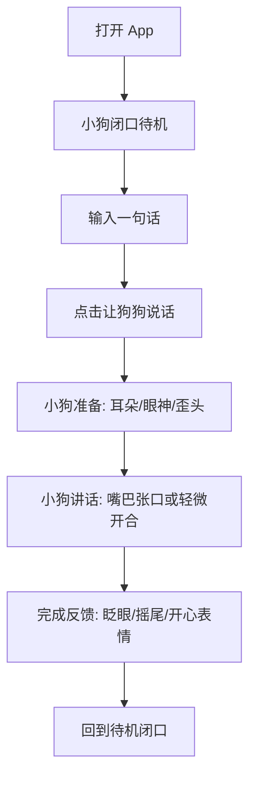
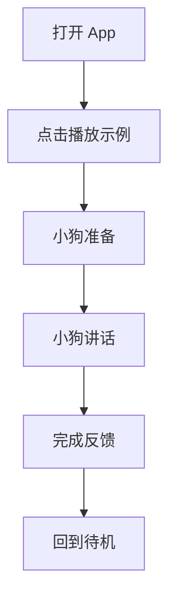
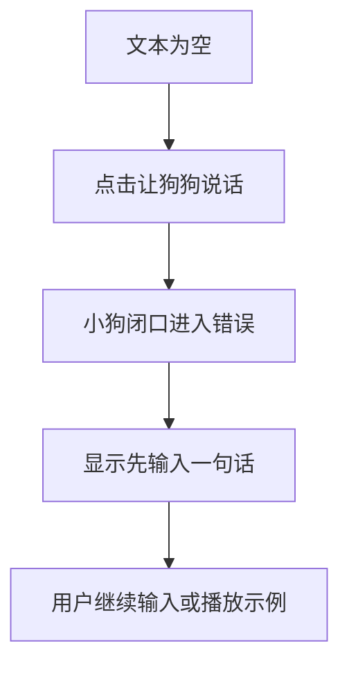

# UX 设计规格：数字狗可爱讲话动画 Demo

**作者：** kejincheng
**创建日期：** 2026-06-23
**修订日期：** 2026-06-25
**状态：** 当前执行版

## 执行摘要

当前 MVP 从“可信口型同步调试体验”简化为“可爱小狗讲话动画体验”。本 UX 规格只服务当前 Sprint，不再要求完整调试台、精确口型同步、上传音频或麦克风录音。

当前 UX 目标：

- 第一眼看到可爱小狗，而不是同步调试工具。
- 用户输入文本或点击示例后，小狗进入讲话状态并张口或轻微开合。
- 小狗不讲话、待机、思考、错误和完成后必须闭口。
- 讲话不需要匹配文本、音素或声音节奏。
- 通过耳朵竖起、歪头、眨眼、轻微身体律动、摇尾等动作体现俏皮感。
- 首屏只保留小狗舞台、主输入、示例入口和轻量状态摘要。

## 平台策略

第一版展示设备为 **小米 Redmi Pad SE 11 英寸 MIUI / Android 平板**。

- 横屏按 1920 x 1200 / 16:10 平板视口优化。
- 竖屏按 1200 x 1920 可用形态处理。
- 技术实现优先 Kotlin、Jetpack Compose、TalkBack 和 Android 系统可访问性。
- 当前 MVP 不请求麦克风权限，不打开系统文件选择器。

## 定义性体验

这个 demo 的定义性体验是：用户输入一句话或点击示例后，小狗像被唤醒的小宠物一样进入讲话循环，并用清晰可见的张口或轻微开合表现“它正在说话”。

第一版必须把主流程做到最顺：

1. 打开 App，看到闭口待机的小狗。
2. 输入文本或点击示例。
3. 小狗短暂准备，耳朵、眼睛或头部给出回应。
4. 小狗进入讲话状态，嘴巴张口或轻微开合。
5. 讲话结束，小狗闭口并眨眼、摇尾或开心反馈。
6. 回到待机。

用户不需要理解口型时间轴、解析质量、波形或延迟校准。

## 目标用户

**内部产品和开发团队。**
需要明确当前 demo 的体验边界、验收标准和实现顺序。

**设计评审者和业务决策者。**
需要快速判断小狗是否可爱、是否像在讲话、是否值得继续投入真实 AI 对话。

**未来终端用户。**
第一版不验证长期陪伴、付费、留存或真实对话，只验证核心互动是否成立。

## 情绪目标

### 主要情绪：软萌可信

用户第一眼要觉得这是一只友好、可互动、愿意靠近的小狗；当它讲话时，要觉得它是在回应，而不是随机动画。

可爱感来自：

- 圆润形体。
- 友好眼神。
- 清晰嘴巴区域。
- 轻微呼吸和眨眼。
- 讲话前后的短反馈。

可信感来自：

- 非讲话状态稳定闭口。
- 讲话状态嘴巴明显开合。
- 状态文字和输入来源清楚。
- 错误可恢复。

### 次要情绪：自然克制

小狗应该像一个安静但有生命感的小伙伴，不是一直卖萌或过度表演。

讲话中用户注意力应落在嘴巴开合上。耳朵、眼睛、头部、身体和尾巴只能增强生命感，不能遮挡嘴巴或造成视觉噪音。

### 失败情绪：问题可恢复

空文本时，小狗可以疑惑或歪头，但反馈必须短、清楚、可恢复。用户应知道下一步是输入一句话或播放示例。

## 体验原则

1. 小狗舞台优先，状态摘要辅助。
2. 主流程只保留文本和示例。
3. 讲话时嘴巴开合是最高优先级视觉变化。
4. 可爱反馈短、轻、准，只出现在准备、完成和错误等关键时刻。
5. 任意失败都不能阻断文本和示例路径。
6. 默认 UI 不展示调试工具。
7. 减少动态时保留讲话嘴，降低装饰动作。

## 信息架构

当前首屏包含：

1. 顶部状态栏：demo 名称、当前状态、输入来源、嘴巴状态。
2. 小狗宠物舞台：小狗、项圈、窝垫或地面。
3. 主输入区：文本输入、`让狗狗说话`。
4. 示例入口：`播放示例`。
5. 轻量状态摘要：当前状态、输入来源、嘴巴状态。
6. 错误反馈：靠近输入区。

默认首屏不包含：

- 上传音频。
- 麦克风录音。
- 波形。
- 嘴型时间轴。
- 文本高亮。
- 延迟校准。
- 完整调试台。
- 解析质量面板。

## 用户旅程

### UJ-1：输入文本让小狗说话

验收重点：

- 准备阶段嘴巴不提前连续开合。
- 讲话阶段嘴巴清楚可见。
- 完成后闭口并回到待机。

### UJ-2：播放示例

验收重点：

- 示例入口不依赖用户输入。
- 示例入口不请求麦克风权限。
- 示例流程和文本流程共享同一状态与嘴巴规则。

### UJ-3：空文本错误恢复

验收重点：

- 空文本不触发讲话。
- 错误文案靠近输入区。
- 小狗错误状态闭口。

## 关键成功时刻

**首屏 3 秒。**
用户必须立刻看懂这是一只可互动小狗，可以输入文本或播放示例让它讲话。

**第一次讲话。**
小狗从闭口待机进入准备、讲话和结束，用户觉得“它在回应我”。

**讲话结束。**
小狗闭口、短反馈、回到待机，用户可以继续下一次尝试。

**错误恢复。**
空文本时界面给出可见反馈，小狗闭口疑惑，但用户不会卡住。

## 组件与行为

### 小狗宠物舞台

目的：承载情绪和讲话表现。

要求：

- 小狗嘴巴区域始终清晰可见。
- 舞台不使用多层嵌套卡片。
- 状态标签不能遮挡嘴巴。
- 横屏小狗是首屏主视觉。
- 竖屏小狗不得被输入区挤压到难以观察。

### 小狗角色

必备表现：

- `idle`：闭口、轻微呼吸、偶尔眨眼。
- `thinking/preparing`：闭口、耳朵竖起、看向用户或轻微歪头。
- `speaking`：讲话嘴或轻微开合循环。
- `done`：闭口、眨眼、摇尾或开心表情。
- `error`：闭口、疑惑或歪头。

当前 MVP 不要求 7 类嘴型。当前 production 只保留闭口和张口两种嘴巴状态，默认 UI 不展示手动嘴型测试。

### 主输入区

目的：承载文本主路径。

内容：

- 文本输入框。
- 主按钮 `让狗狗说话`。
- 空文本提示 `先输入一句话`。

行为：

- 非空文本触发讲话流程。
- 空文本进入错误。
- 播放中主按钮禁用、显示 `讲话中` 或切换为停止状态。
- 播放中不允许创建第二个讲话流程。

### 示例入口

目的：提供稳定兜底演示。

内容：

- 次级按钮 `播放示例`。

行为：

- 点击后触发同样讲话流程。
- 不请求麦克风权限。
- 播放中禁用或进入停止状态。

### 轻量状态摘要

目的：让用户理解当前状态，而不是调试同步。

内容：

- 当前状态：`待机`、`准备中`、`讲话中`、`完成`、`需要处理`。
- 输入来源：`文本`、`示例`。
- 嘴巴状态：`闭口`、`讲话嘴`。

限制：

- 不显示波形、时间轴、文本高亮、延迟校准。
- 不显示上传、麦克风或解析质量。

## 布局策略

### 横屏

- 顶部状态栏。
- 中央大宠物舞台。
- 底部输入区和示例入口。
- 状态摘要靠近输入区或顶部状态栏，不遮挡嘴巴。

### 竖屏

- 顶部状态栏。
- 宠物舞台优先。
- 文本输入和按钮紧跟舞台。
- 状态摘要和错误反馈位于输入区附近。

### 布局稳定

- 播放中主区域尺寸不变化。
- 状态摘要使用固定或最小尺寸。
- 按钮文字不得溢出。
- 横竖屏核心控件不得重叠。

## 视觉系统

沿用 `docs/UI-SPEC.md` 中的 tokens：

- 背景 `#F7FAF7`
- 主表面 `#FFFFFF`
- 次表面 `#EEF6F3`
- 主文字 `#24302F`
- 次文字 `#66736F`
- 宠物暖色 `#F2B6A0`
- 科技蓝 `#4C8DFF`
- 强调珊瑚 `#FF6F61`
- 成功绿 `#37A86B`
- 提示黄 `#E7A93F`
- 边框 `#DDE7E3`

视觉约束：

- 不使用渐变球、散景圆点或纯装饰光斑。
- 不使用大面积单一色相主题。
- 主 CTA 使用强调珊瑚。
- 错误使用提示黄并配文字。
- 状态颜色不能单独承担信息表达。

## 动效策略

| 状态 | 动效 |
| --- | --- |
| `idle` | 呼吸、低频眨眼 |
| `thinking/preparing` | 耳朵竖起、看向用户、轻微歪头 |
| `speaking` | 嘴巴张口或轻微开合，低幅度点头或身体律动 |
| `done` | 闭口、眨眼或摇尾 |
| `error` | 闭口、疑惑或歪头 |

动效约束：

- 讲话嘴是最高视觉优先级。
- 头、耳、身体、尾巴动作不得遮挡嘴巴。
- 完成反馈短于 1 秒。
- 错误反馈短且可恢复。
- 减少动态时降低装饰动作，但保留嘴巴开合。

## 可访问性

- 主 CTA、文本输入、示例入口和错误反馈必须可聚焦。
- TalkBack 能读出当前状态、输入来源、嘴巴状态和错误原因。
- 小狗图形可作为装饰，但状态必须有文本语义。
- 触控目标不小于 48dp。
- 键盘焦点顺序：顶部状态、小狗状态、文本输入、主 CTA、示例入口、状态摘要、错误反馈。
- 减少动态不应移除核心状态表达。

## 当前不设计

以下设计项移出当前 MVP：

- 上传音频入口。
- 麦克风录音入口。
- 完整调试台。
- 波形进度组件。
- 嘴型时间轴组件。
- TTS 文本高亮组件。
- 延迟校准控件。
- 解析质量面板。
- 实验入口分组。

后续恢复时，需要新的 UX scope change 和单独设计规格。

## UX 验收清单

- [ ] 首屏 3 秒内能看懂小狗可互动。
- [ ] 文本主入口和示例入口首屏可见。
- [ ] 小狗在非讲话状态闭口。
- [ ] 小狗讲话时嘴巴张口或轻微开合。
- [ ] 准备、完成和错误有短而克制的情绪反馈。
- [ ] 状态摘要表达当前状态、输入来源和嘴巴状态。
- [ ] 空文本错误清楚且可恢复。
- [ ] 横屏和竖屏核心控件不重叠。
- [ ] 默认 UI 不出现上传、麦克风、波形、时间轴、文本高亮或延迟校准。
- [ ] TalkBack 和减少动态策略覆盖核心流程。
